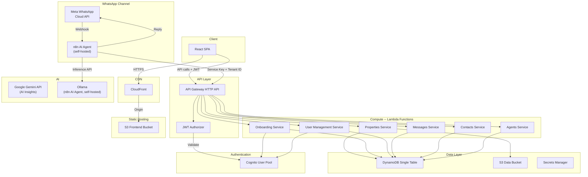
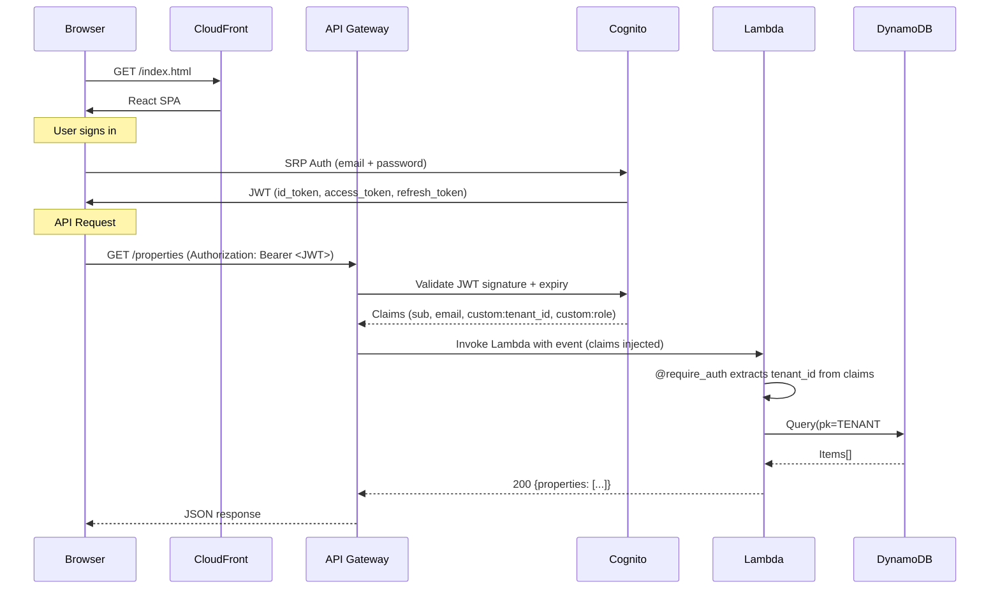
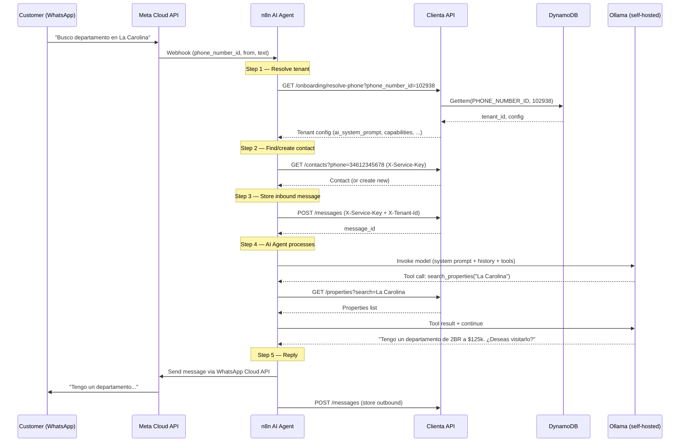
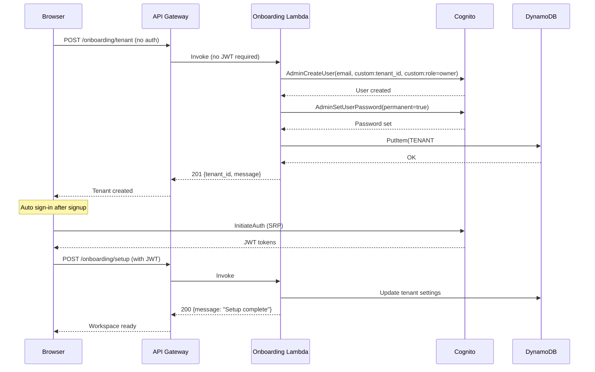
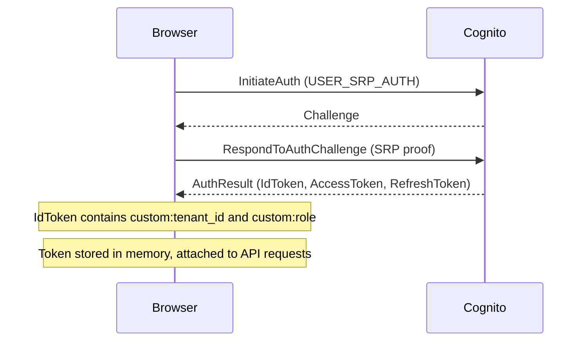
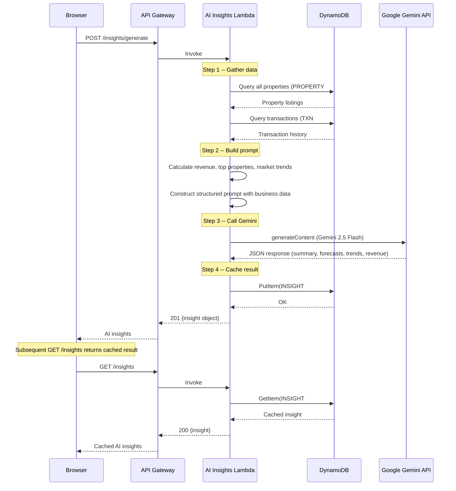
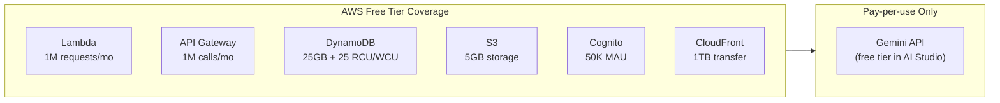

# Clienta AI — Architecture

## System Overview



All services run as Lambda functions (Python 3.12) behind a single API Gateway HTTP API. Data is stored in a single DynamoDB table using a multi-tenant single-table design. The React SPA is served from S3 via CloudFront.

WhatsApp messages are handled by n8n (self-hosted): Meta sends webhooks directly to n8n, which runs an AI Agent (Ollama, self-hosted) to process conversations. n8n calls the Clienta API using a service key (`X-Service-Key` + `X-Tenant-Id` headers) to manage contacts, messages, and property listings. Tenant resolution uses Meta's `phone_number_id` mapped in DynamoDB.

---

## Request Lifecycle



Key points:
- For browser requests, API Gateway validates the JWT before Lambda is invoked
- For n8n/service requests, Lambda validates the `X-Service-Key` header and reads `X-Tenant-Id`
- The `extract_tenant_id()` function tries JWT first, then falls back to service key auth
- All DynamoDB queries are scoped to the tenant's partition key, ensuring data isolation

---

## WhatsApp AI Agent (n8n)



Key design decisions:
- Meta sends webhooks directly to n8n (no Lambda in between) for simplicity
- One n8n workflow handles all tenants — tenant config is loaded dynamically per message
- The AI Agent uses Ollama (self-hosted) with tool calling for properties, contacts, and lead scoring.
- Service key auth (`X-Service-Key` + `X-Tenant-Id`) enables n8n to act on behalf of any tenant
- Tenant resolution uses Meta's `phone_number_id` (stable, unique per business phone)

---

## DynamoDB Single-Table Design

All entities share one table. The partition key (`pk`) is always `TENANT#<tenant_id>`, ensuring all of a tenant's data is co-located for efficient queries.

```mermaid
erDiagram
  TABLE {
    string pk "TENANT#<tenant_id>"
    string sk "Entity-specific sort key"
    string gsi1pk "Optional GSI1 partition"
    string gsi1sk "Optional GSI1 sort"
    number ttl "TTL epoch (optional)"
  }
```

### Access Patterns

| Access Pattern                       | PK                          | SK / Key Condition                    | Index    |
| ------------------------------------ | --------------------------- | ------------------------------------- | -------- |
| Get tenant                           | `TENANT#<tid>`              | `TENANT#<tid>`                        | Table    |
| List all properties                  | `TENANT#<tid>`              | `begins_with(PROPERTY#)`              | Table    |
| Get one property                     | `TENANT#<tid>`              | `PROPERTY#<pid>`                      | Table    |
| List users in tenant                 | `TENANT#<tid>`              | `begins_with(USER#)`                  | Table    |
| Get one user                         | `TENANT#<tid>`              | `USER#<uid>`                          | Table    |
| Resolve tenant from phone_number_id  | `PHONE_NUMBER_ID`           | `<phone_number_id>`                   | Table    |
| Cross-entity query by SK             | --                          | SK as partition key                   | GSI2     |

### Entity Key Patterns

Properties use a composite SK when needed, enabling efficient queries and natural ordering.

---

## Authentication Flow

### Signup (Tenant Onboarding)



### Sign In



The frontend uses `amazon-cognito-identity-js` for SRP authentication. JWTs are stored in memory (not localStorage) and attached as `Authorization: Bearer <token>` on every API call.

---

## AI Insights Pipeline



Key design decisions:
- Insights are generated on-demand (not scheduled) to minimize API costs
- Results are cached in DynamoDB with a 7-day TTL for automatic cleanup
- The prompt includes structured business data (inventory stats, transaction summaries) for grounded analysis
- Gemini 2.5 Flash is used for cost efficiency (free tier available in Google AI Studio)

---

## Multi-User Tenant Model

Each tenant supports multiple users with a role hierarchy:

| Role      | Level | Can Invite       | Can Manage       |
| --------- | ----- | ---------------- | ---------------- |
| `owner`   | 3     | managers + staff | managers + staff |
| `manager` | 2     | staff only       | staff only       |
| `staff`   | 1     | nobody           | nobody           |

Users are created in both Cognito (for authentication) and DynamoDB (for tenant-scoped queries). The `custom:tenant_id` and `custom:role` JWT claims ensure data isolation and role enforcement at every API call.

---

## Cost Architecture



At 0-50 customers, estimated monthly cost is $5-25. AI Insights uses Gemini (free tier covers most usage). Caching insights daily per tenant keeps API calls minimal.
